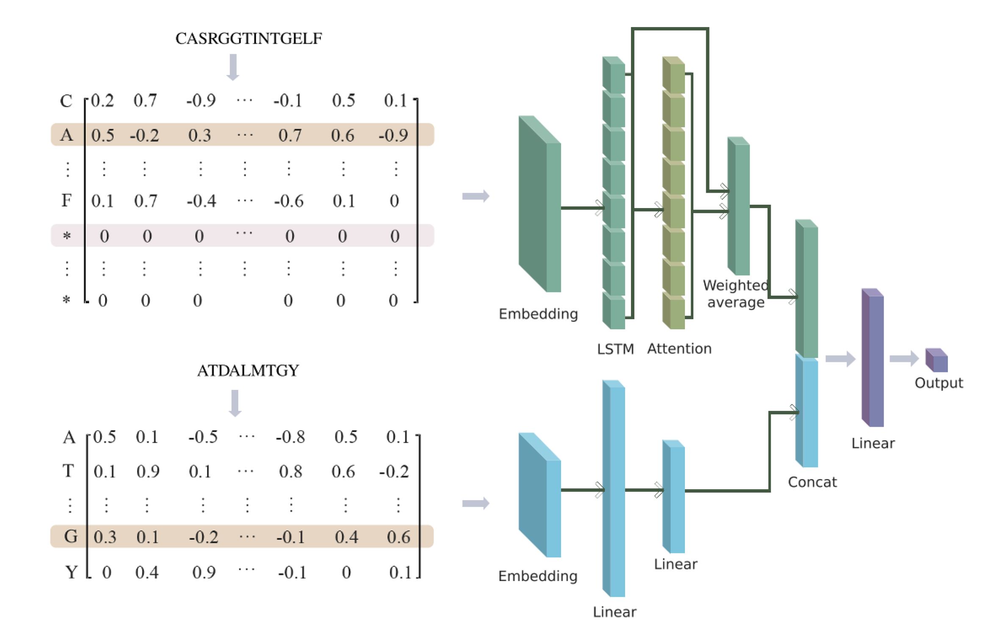

AttnTAP
========

AttnTAP: An attention-fused BiLSTM model used to predict TCR-peptide binding accuracy
------------------------------------------------------------------------

AttnTAP is a dual-input deep learning framework for improving the prediction accuracy of TCR recognition of peptides. We employ a bi-directional LSTM (BiLSTM) model coupled with feature representations of embedding matrix and attention mechanism.




## Content
<!-- @import "[TOC]" {cmd="toc" depthFrom=1 depthTo=6 orderedList=false} -->

<!-- code_chunk_output -->
- [Project Organization](#project-organization)
- [Usage](#usage)
  - [Python package versions](#python-package-versions)
  - [Making predictions using the pre-trained model](#making-predictions-using-the-pre-trained-model)
  - [Training DeepLION models](#training-deeplion-models)
- [Contacts](#contacts)


<!-- /code_chunk_output -->


## Project Organization

    ├── LICENSE                         <- Non-commercial license.
    │     
    ├── README.md                       <- The README for users using AttnTAP.
    │ 
    ├── Codes                           <- Python scripts of AttnTAP. See README for their usages.
    │   ├── AttnTAP_test.py             <- Making predictions using pre-trained AttnTAP models.
    │   ├── AttnTAP_train.py            <- Training AttnTAP models.
    │   ├── network.py                  <- The network of AttnTAP.
    │   └── AttnTAP_data_clean.py       <- Processing raw data files.
    │
    ├── Data                            <- Data used in AttnTAP.
    │   ├── VDJdb
    │   │   ├──VDJdb_test.csv  
    │   │   ├──VDJdb_train.csv   
    │   │   ├──VDJdb_raw.csv   
    │   │   ├──VDJdb_crossvalid_data    <- A set of experimental data for cross-validation.
    │   │ 
    │   ├── McPAS
    │   │   ├──McPAS_test.csv  
    │   │   ├──McPAS_train.csv   
    │   │   ├──McPAS_raw.csv   
    │   │   ├──McPAS_crossvalid_data    <- A set of experimental data for cross-validation.
    │   │  
    │   ├── example_raw_file.csv        <- Example of unprocessed raw data.
    │  
    ├── Figure                          <- Figure used in readme.
    │   └── AttnTAP.png 
    │
    ├── Models                          <- Pre-trained AttnTAP models for users making predictions directly.               
    │   ├── cv_model_0_mcpas_0.pth      <- The model obtained by taking mcpas_0.csv as the test set and other data as the training set in the cross-validation experiment.
    │   └── cv_model_0_vdjdb_0.pth      <- The model obtained by taking vdjdb_0.csv as the test set and other data as the training set in the cross-validation experiment.
    │      
    └── Results                         <- Some results of using AttnTAP.
        ├── example_data_clean.csv      <- The result file after processing `example_raw_file.csv`.
        ├── cv_0_mcpas_0.csv            <- Prediction results on mcpas_0.csv using the corresponding pre-trained model.
        └── cv_0_vdjdb_0.csv            <- Prediction results on vdjdb_0.csv using the corresponding pre-trained model.

## Usage

### Python package versions

AttnTAP works perfectly in the following versions of the Python packages:

    python          3.9.7
    torch           1.11.0+cpu
    pandas          1.3.4
    numpy           1.20.3
    scikit-learn    0.24.2
    matplotlib      3.5.1
    gensim          4.1.2

### Making predictions using the pre-trained model

Users can use the pre-trained models we provided in `./Models/` to make predictions directly.
First, we need to collect the raw data files, such as `./Data/example_raw_file.csv`, and use the Python script `./Codes/AttnTAP_data_clean.py` to process them by this command:

    python ./Codes/AttnTAP_data_clean.py --input_file=./Data/example_raw_file.csv --output_file=./Results/example_data_clean.csv --neg_samples=1

After processing, CDR3 sequences, antigen sequences, and labels, are saved in `./Results/example_data_clean.csv`.

    tcr             antigen	                label
    CASSQEGTGSYEQYF	AVFDRKSDAK              1
    CASSQEGTGSYEQYF	FRDYVDRFYKTLRAEQASQE    0
    CATSDRDDSYGYTF	AVFDRKSDAK              1
    CATSDRDDSYGYTF	PKYVKQNTLKLAT           0
    CAWSVSGATDEQFF	AVFDRKSDAK              1
    CAWSVSGATDEQFF	RLRAEAQVK               0

Then, we use the Python script `./Codes/AttnTAP_test.py` to make predictions and evaluate the performance of AttnTAP  on the processed data files in `./Data/McPAS/McPAS_crossvalid_data/0/mcpas_0.csv` using the pre-trained model `./Models/cv_model_0_mcpas_0.pt` by this command:

    python ./Codes/AttnTAP_test.py --input_file=./Data/McPAS/McPAS_crossvalid_data/0/mcpas_0.csv --output_file=./Results/cv_0_mcpas_0.csv --load_model_file=./Models/cv_model_0_mcpas_0.pt

The prediction results, including CDR3 sequences, antigen sequences, and probabilities of binding, are saved in `./Results/cv_0_mcpas_0.csv.`

    	tcr                 antigen                 prediction
    0	CASSACDCIRKIYGYTF   WEDLFCDESLSSPEPPSSSE    0.98302865
    1	CASSISSGSYNEQFF     VTEHDTLLY               0.5213805
    2	CASSSRDIGFYEQYF     RAKFKQLL                0.17534448
    3	CASSPSGRLNEQYF      LPRRSGAAGA              0.9469173
    4	CASSPEGTGSYEQYF     RPHERNGFTVL             0.4462932
    5	CASSPPGIGGYNEQFF    RPHERNGFTVL             0.32671145

Accuracy(ACC), area under the receiver operating characteristic curve(AUC), recall(Recall), precision(Precision), F1 score(F1), are calculated and printed as:

    -----test results-----
    ACC:             0.779
    AUC:             0.866
    Recall:          0.818
    Precision:       0.760
    F1:              0.788
    The work is done!

### Training AttnTAP models

Users can use the Python script `./Codes/AttnTAP_train.py` to train their own AttnTAP models on their TCR-antigen data samples for a better prediction performance by this command:

    python  ./Codes/AttnTAP_train.py --input_file=./Data/McPAS/McPAS_train.csv --save_model_file=./Models/McPAS_train.pt --valid_set=False --epoch=15 --learning_rate=0.005 --dropout_rate=0.1 --embedding_dim=10 --hidden_dim=50 --plot_train_curve=False --plot_roc_curve=False

The training results are calculated and printed as:
```
Epoch-1 Train loss 0.5603
Epoch-2 Train loss 0.5359
Epoch-3 Train loss 0.5159
Epoch-4 Train loss 0.4941
Epoch-5 Train loss 0.4732
Epoch-6 Train loss 0.452
Epoch-7 Train loss 0.4364
Epoch-8 Train loss 0.4252
Epoch-9 Train loss 0.4035
Epoch-10 Train loss 0.3859
Epoch-11 Train loss 0.3764
Epoch-12 Train loss 0.36
Epoch-13 Train loss 0.3436
Epoch-14 Train loss 0.3255
Epoch-15 Train loss 0.3151
-----train results-----
ACC:             0.875
AUC:             0.951
Recall:          0.885
Precision:       0.867
F1:              0.876
The work is done!
```
## Contacts
AttnTAP is actively maintained by Xinyang Qian & Fan Li, currently students at Xi'an Jiaotong University in the research group of Prof. Jiayin Wang.
If you have any questions, please contact us by e-mail: qianxy@stu.xjtu.edu.cn / lifan0513@stu.xjtu.edu.cn.


